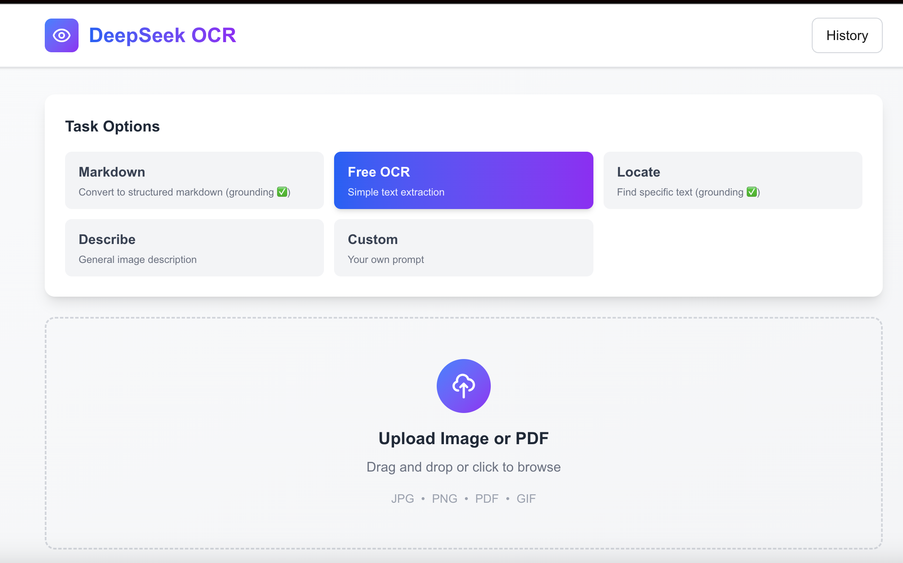

# 🚀 OCR Extractor - DeepSeek-OCR Web Application

A modern, production-ready web application for Optical Character Recognition (OCR) powered by **DeepSeek-OCR**. Extract text from images, PDFs, and documents with advanced AI-powered recognition capabilities.



## ✨ Features

### 🎯 Core OCR Capabilities
- **Free OCR**: Simple text extraction from images and documents
- **Markdown Conversion**: Convert documents to structured markdown format (with bounding boxes)
- **Location Finding**: Find and locate specific text in images (with bounding boxes)
- **Image Description**: Detailed image descriptions using AI vision
- **Custom Prompts**: Create your own OCR tasks with custom prompts

### 🚀 Advanced Features
- **Smart Caching**: Intelligent client and server-side caching (30-day expiry)
  - Automatic duplicate detection using SHA-256 hashing
  - Instant results for previously processed images
  - "From Cache" badge indicator
- **Drag & Drop Upload**: Modern file upload interface with drag-and-drop support
- **Image Preview**: Preview uploaded images before processing
- **History Panel**: View and access past OCR results (stored in browser)
- **Copy & Download**: Easily copy text to clipboard or download as .txt file
- **Task Selection**: Choose from multiple OCR tasks with dedicated prompts
- **Responsive Design**: Beautiful, modern UI that works on all devices
- **Framer Motion Animations**: Smooth transitions and delightful interactions

### 🔧 Technical Stack
- **Frontend**: Next.js 16 (React 18), TypeScript, TailwindCSS
- **Backend**: Flask (Python), DeepSeek-OCR model
- **Caching**: Client-side (localStorage) + Server-side (JSON file)
- **Animations**: Framer Motion
- **File Processing**: SHA-256 hashing for unique identification

## 📸 Screenshots

The OCR Extractor web app features a clean, modern interface with intuitive task selection, real-time processing, and comprehensive result management.

### Main Interface with Task Options


*Select from multiple OCR tasks including Markdown conversion, Free OCR, Location finding, Image description, and Custom prompts*

## 🚀 Quick Start

### Prerequisites

- **Node.js 20.9.0 or higher**
- **Python 3.9+**
- **DeepSeek-OCR** set up in `DeepSeek-OCR/` directory

### Installation

1. **Clone the repository**
```bash
git clone https://github.com/delevski/OCR-extractor.git
cd OCR-extractor
```

2. **Set up the frontend**
```bash
cd ocr-webapp
npm install
```

3. **Set up the backend**

Create a virtual environment and install dependencies:
```bash
cd ../DeepSeek-OCR
python -m venv venv
source venv/bin/activate  # On Windows: venv\Scripts\activate
pip install -r requirements.txt
```

4. **Start the backend server**
```bash
cd ../ocr-webapp
source ../DeepSeek-OCR/venv/bin/activate
python server.py
```

The backend will start on `http://localhost:5000`

5. **Start the frontend** (in a new terminal)
```bash
cd ocr-webapp
npm run dev
```

The frontend will be available at `http://localhost:3000`

## 📖 Usage Guide

### Basic OCR

1. Select a task option (e.g., "Free OCR")
2. Upload an image or drag & drop it onto the upload area
3. Wait for processing (typically 5-15 seconds)
4. View the extracted text in the results panel
5. Copy or download the result

### Task Options

#### 📝 Markdown
Converts documents to structured markdown format with bounding boxes.

**Prompt**: `Convert the document to structured markdown.`

#### 🔍 Free OCR
Simple text extraction from images.

**Prompt**: `Free OCR.`

#### 📍 Location
Finds specific text locations with bounding boxes.

**Prompt**: `Find specific text in image.`

#### 🖼️ Describe
Provides detailed image descriptions.

**Prompt**: `Describe this image in detail.`

#### ⚙️ Custom
Create your own OCR task with a custom prompt.

**Tip**: Add `<|grounding|>` to your prompt to enable bounding boxes.

### Caching Feature

The app automatically caches results for 30 days:

- **First upload**: Image is processed and cached
- **Subsequent uploads**: Instant results from cache (marked with "From Cache" badge)
- **Cache key**: SHA-256 file hash + task + prompt
- **Storage**: Client (localStorage) + Server (cache_data.json)

### History

Access your last 10 OCR results:
- Click the "History" button in the header
- Select any past result to view it again
- History persists across browser sessions

## 🏗️ Project Structure

```
OCR-extractor/
├── ocr-webapp/                 # Frontend application
│   ├── app/
│   │   ├── components/         # React components
│   │   │   ├── FileUpload.tsx
│   │   │   ├── ResultsPanel.tsx
│   │   │   ├── HistoryPanel.tsx
│   │   │   ├── LoadingAnimation.tsx
│   │   │   └── Header.tsx
│   │   ├── utils/
│   │   │   └── cache.ts        # Client-side caching logic
│   │   ├── page.tsx            # Main page
│   │   └── layout.tsx
│   ├── server.py               # Backend Flask server
│   ├── mock-server.js          # Mock server for testing
│   └── package.json
├── DeepSeek-OCR/              # OCR backend
│   ├── demo_ocr_full_cpu.py   # CPU-compatible OCR demo
│   ├── requirements.txt
│   └── ...
└── README.md
```

## 🔧 Configuration

### Backend Configuration

Edit `ocr-webapp/server.py`:

```python
# Change the port
app.run(host='0.0.0.0', port=5000, debug=True)

# Adjust cache expiry
CACHE_EXPIRY_DAYS = 30
```

### Frontend Configuration

Edit `ocr-webapp/app/page.tsx`:

```typescript
// Change the backend URL
const response = await fetch('http://localhost:5000/infer', {
  method: 'POST',
  body: formData,
});
```

## 🛠️ Development

### Running in Development Mode

**Backend**:
```bash
cd ocr-webapp
source ../DeepSeek-OCR/venv/bin/activate
python server.py
```

**Frontend**:
```bash
cd ocr-webapp
npm run dev
```

### Using the Mock Server (for frontend testing)

If you want to test the frontend without the backend:

```bash
cd ocr-webapp
node mock-server.js
```

The mock server will respond with fake OCR results on port 5000.

## 📝 API Documentation

### POST `/infer`

Process an image through OCR.

**Request**:
- Method: `POST`
- Content-Type: `multipart/form-data`
- Body:
  - `file`: Image file (required)
  - `task`: Task type (optional, default: 'free')
  - `prompt`: Custom prompt (optional)
  - `fileHash`: SHA-256 hash of the file (optional)

**Response**:
```json
{
  "text": "Extracted text...",
  "success": true,
  "fromCache": false
}
```

## 🐛 Troubleshooting

### "localStorage is not defined" error

This occurs during server-side rendering. Make sure you're using `useEffect` for any `localStorage` access.

### "Failed to fetch" error

Ensure the backend server is running on port 5000:
```bash
cd ocr-webapp
python server.py
```

### Slow processing

DeepSeek-OCR is computationally intensive:
- First run: 10-30 seconds (model loading)
- Subsequent runs: 5-15 seconds
- Use caching to skip re-processing

### Node.js version error

Install and use Node.js 20.9.0 or higher:
```bash
nvm install 20
nvm use 20
```

## 🤝 Contributing

Contributions are welcome! Please feel free to submit a Pull Request.

## 📄 License

This project is licensed under the MIT License - see the [LICENSE](LICENSE) file for details.

## 🙏 Acknowledgments

- [DeepSeek-OCR](https://github.com/deepseek-ai/DeepSeek-OCR) for the powerful OCR model
- [Next.js](https://nextjs.org/) for the web framework
- [Framer Motion](https://www.framer.com/motion/) for animations

## 📞 Support

For issues and questions:
- Open an issue on [GitHub](https://github.com/delevski/OCR-extractor/issues)
- Check the [documentation](https://github.com/delevski/OCR-extractor/wiki)

---

**Made with ❤️ using DeepSeek-OCR**
